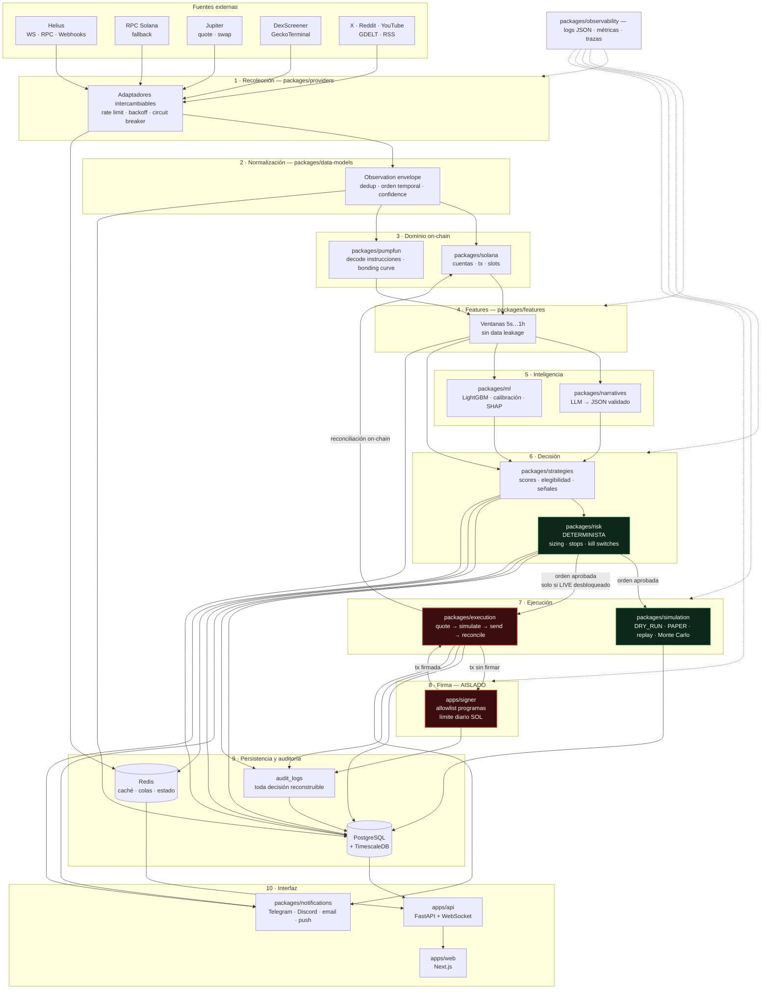

# Arquitectura

Documento de referencia de la estructura del sistema. El *qué* está en `SPEC.md`; los
guardarraíles en `CLAUDE.md` §1–§3.

---

## 1. Principio rector

Once capas estrictamente separadas (SPEC.md §2), cada una detrás de una interfaz, con
**dependencias en un solo sentido**: una capa solo conoce a la que tiene inmediatamente debajo.
Ningún módulo de análisis importa un adaptador concreto de proveedor; todos hablan con las
abstracciones de `packages/providers`.

Tres fronteras son de seguridad, no de estilo, y no se cruzan nunca:

1. **LLM → dinero.** El LLM produce JSON validado sobre narrativas. No entra en el camino de
   decisión monetaria. `RiskEngine` es determinista y no recibe entrada del LLM.
2. **Backend → clave privada.** `apps/api` y `apps/worker` no tienen acceso al material
   criptográfico. Solo `apps/signer`, en su propio proceso y contenedor.
3. **Señal → orden.** Una señal nunca se ejecuta sola. Pasa por elegibilidad (§12), sizing
   determinista (§14) y validación previa a firma (§15).

---

## 2. Diagrama de capas



### Camino de una decisión, en orden

```
evento on-chain
  → adaptador (provider)                     latencia medida, confidence asignada
  → envelope normalizado                     dedup por (provider, signature|slot)
  → decode Pump.fun                          bonding curve, creator, primera cohorte
  → features por ventana                     solo datos anteriores al timestamp
  → scores + narrativa                       13 scores independientes (§11)
  → reglas de elegibilidad                   16 vetos duros (§12); si falla uno, IGNORE
  → señal                                    con invalidación y salida prevista (§13)
  → RiskEngine                               tamaño, stops, límites diarios (§14)
  → DRY_RUN | PAPER | LIVE                   LIVE solo si el checklist está completo
  → [LIVE] quote → simulateTransaction → firma aislada → envío → confirmación
  → reconciliación contra estado on-chain
  → audit_logs                               entrada completa, reconstruible
```

---

## 3. Responsabilidad de cada paquete

### `/apps`

| App | Responsabilidad | No hace |
|---|---|---|
| **`api`** | FastAPI. REST de lectura + WebSocket de streaming al dashboard. Autenticación de la UI. Confirmación de kill switch y de desbloqueo LIVE. | No decide operaciones. No accede a claves. No llama a proveedores externos directamente. |
| **`web`** | Next.js + TypeScript estricto. Dashboard, radar, detalle de token, simulación, operaciones, configuración. Solo consume `api`. | No calcula scores ni riesgo. No habla con Solana. |
| **`worker`** | Procesos de larga duración: ingesta WebSocket, jobs de features, entrenamiento y evaluación de modelos, snapshots periódicos, reconciliación. | No expone HTTP público. No firma. |
| **`signer`** | **Servicio aislado.** Único componente con acceso a la clave. Valida allowlist de programas, límite por orden, límite diario acumulado y destino. Registra cada solicitud. | No decide qué firmar. No consulta mercado. No conoce estrategias. |

### `/packages`

| Paquete | Responsabilidad | Depende de |
|---|---|---|
| **`shared`** | Config tipada (`pydantic-settings`), errores base, tipos de tiempo y dinero (lamports/SOL sin float), utilidades de reloj e ids idempotentes. | — |
| **`data-models`** | Contratos Pydantic v2 de todo el sistema: envelope de observación (SPEC.md §5), token, trade, holder, quote, señal, orden, posición. Fuente única de verdad de los tipos. | `shared` |
| **`observability`** | Logging estructurado JSON, métricas Prometheus, trazas OpenTelemetry, decoradores de latencia. Toda decisión debe quedar reconstruible. | `shared` |
| **`solana`** | Primitivas de cadena: cliente RPC tipado, suscripciones, lectura y parseo de cuentas, transacciones versionadas, compute budget y priority fees, `simulateTransaction`. | `shared`, `data-models` |
| **`pumpfun`** | Conocimiento del programa Pump.fun y PumpSwap: decodificación de instrucciones y cuentas, estado de bonding curve, umbral de graduación derivado de las reservas, detección de migración. | `solana` |
| **`providers`** | **Interfaces abstractas** de todas las fuentes + adaptadores concretos intercambiables. Rate limiting, caché, backoff, circuit breakers, health. Aísla toda API no oficial. | `data-models` |
| **`features`** | Feature engineering por ventanas (5s–1h). Garantiza ausencia de data leakage: una feature solo usa información anterior al timestamp de predicción. | `data-models` |
| **`narratives`** | `NarrativeEngine`: clustering semántico, extracción de entidades, estados NASCENT→EXHAUSTED, fit token-narrativa. Único punto donde entra un LLM, y siempre con salida JSON validada contra esquema. | `data-models`, `providers` |
| **`strategies`** | Los 13 scores de §11, el `OpportunityScore`, las reglas de elegibilidad de §12 y el motor de señales de §13. Modo heurístico y modo modelo. | `features`, `narratives`, `ml` |
| **`risk`** | `RiskEngine` **determinista**: sizing, exposición, límites diarios/semanales, drawdown, cooldowns, los nueve tipos de stop y los kill switches. Sin ML, sin LLM, sin aleatoriedad. | `data-models` |
| **`execution`** | `ExecutionEngine` con modos `DRY_RUN` / `PAPER` / `LIVE`. Secuencia de 14 pasos de §15, idempotency keys, reintentos acotados, reconciliación. Habla con `signer` por HTTP local. | `solana`, `pumpfun`, `providers`, `risk` |
| **`simulation`** | Simulador event-driven: latencias por etapa, slippage, price impact, fills parciales, fallos. Modos replay histórico, paper live, Monte Carlo y stress test. | `data-models`, `features` |
| **`ml`** | Entrenamiento y servicio de modelos tabulares. Triple-barrier labeling, walk-forward, calibración, SHAP, detección de drift y desactivación automática de modelos degradados. | `features` |
| **`notifications`** | Envío por Telegram, Discord, email y web push. Plantillas con datos verificables, nunca mensajes vagos. Deduplicación y rate limit por tipo de alerta. | `data-models` |

### `/infrastructure`

| Directorio | Contenido |
|---|---|
| `docker` | Dockerfiles por servicio. El de `signer` es deliberadamente mínimo y sin red saliente salvo RPC. |
| `migrations` | Alembic. `versions/0001` crea las 31 tablas de §23; `0002` convierte las series temporales en hypertables. |
| `prometheus` | Configuración de scraping. |
| `grafana` | Datasources y dashboards provisionados. |

### `/tests`

`unit` (sin red ni BD) · `integration` (Postgres/Redis reales) · `e2e` (stack completo con
Playwright) · `load` (ingesta sostenida) · `fixtures` (payloads capturados, nunca inventados) ·
`replay` (secuencias de eventos históricos para el simulador).

---

## 4. Convención de nombres del monorepo

SPEC.md §26 fija directorios en kebab-case (`packages/data-models`). Python no puede importar un
paquete con guion. Convención adoptada:

```
packages/data-models/mit_data_models/__init__.py   →  import mit_data_models
apps/api/mit_api/__init__.py                       →  import mit_api
```

Un único `pyproject.toml` en la raíz (SPEC.md §27 lo pide en singular) declara los 17 módulos en
`[tool.hatch.build.targets.wheel]`. Esto evita 17 archivos de configuración y mantiene una sola
definición de lint, type-check y tests.

---

## 5. Flujos de datos y almacenamiento

| Dato | Dónde vive | Por qué |
|---|---|---|
| Series temporales (precio, liquidez, holders, curva, features, scores) | PostgreSQL + TimescaleDB, hypertables particionadas por tiempo | Consultas por rango y por mint; compresión nativa |
| Transacciones y swaps crudos | PostgreSQL, índice por `(mint, block_time)` y único por `signature` | Auditoría y replay determinista |
| Estado caliente (último precio, cotización vigente, locks) | Redis, TTL corto | Latencia; se puede perder sin corromper nada |
| Colas de trabajo | Redis + Arq | Reintentos e idempotencia |
| Decisiones y órdenes | PostgreSQL, `audit_logs` append-only | SPEC.md §24: toda decisión real reconstruible |
| Claves | Nunca en BD. Archivo cifrado o keychain, solo visible para `signer` | SPEC.md §16 |

---

## 6. Modos de operación

| Modo | Genera señales | Simula fills | Envía transacciones | Requiere |
|---|---|---|---|---|
| `DRY_RUN` | ✅ | ❌ | ❌ | nada — es el arranque por defecto |
| `PAPER` | ✅ | ✅ | ❌ | nada |
| `LIVE` | ✅ | ✅ | ✅ | `ENABLE_LIVE_TRADING=true` + checklist §30 completo + confirmación en UI + PIN |

El modo se resuelve al arrancar y queda registrado en `audit_logs`. Un cambio de modo es un
evento auditado, nunca silencioso.

---

## 7. Resiliencia

Reconexión WebSocket con backoff, heartbeats, fallback de RPC, circuit breakers por proveedor,
rate limiters, deduplicación por clave natural, event replay desde checkpoints, idempotencia en
toda escritura y reconciliación contra estado on-chain al reiniciar.

Ante pérdida de conexión: **no se abren posiciones nuevas**, se mantiene vigilancia de las
abiertas por proveedor de respaldo, se evalúa salida segura y se avisa al usuario.

---

## 8. Decisiones abiertas

| Decisión | Opciones | Cuándo se resuelve |
|---|---|---|
| Cola de trabajos | Arq (elegido provisionalmente, asyncio nativo) vs Dramatiq vs Celery | Fase 1, al medir carga real de ingesta |
| TimescaleDB obligatorio o degradable | Hypertables vs particionado nativo + BRIN | Fase 1; `0002` ya es tolerante a su ausencia |
| Ubicación del LLM | API externa vs modelo local | Fase 2 |
| Almacenamiento de la clave | Archivo cifrado libsodium vs Keychain macOS vs hardware | Fase 6 |
| Destino del código `pumpscope` legacy | Archivar en `legacy/` vs portar estimadores a `features` | Fase 2 |
